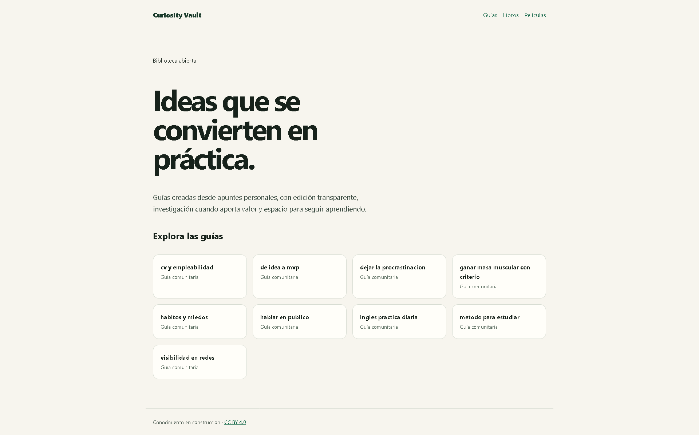

# Curiosity Vault

> Aprender no debería quedarse perdido entre notas, videos guardados y pestañas abiertas.

Curiosity Vault convierte curiosidad en conocimiento útil y compartible:
apuntes reales, guías claras, fuentes transparentes y espacio para que más
personas aporten lo que están aprendiendo.

## ¿Para qué existe?

Para construir una biblioteca comunitaria en español sobre aprendizaje,
empleabilidad, proyectos, hábitos y cultura. No buscamos consejos mágicos:
queremos ideas que puedas entender, cuestionar y poner a prueba.

## Tu experiencia también puede ayudar

¿Encontraste una técnica que te funcionó? ¿Tienes una fuente mejor? ¿Puedes
corregir, traducir o mejorar una guía?

[Explora cómo contribuir](CONTRIBUTING.md) · [Lee las guías](contenido/) · [Propón una idea](../../issues/new)

## Contenido publicado

### Guías

- [Aprende inglés con práctica diaria](contenido/guias/ingles-practica-diaria.md)
- [CV y empleabilidad: demuestra tu valor](contenido/guias/cv-y-empleabilidad.md)
- [De idea a MVP: construir para aprender](contenido/guias/de-idea-a-mvp.md)
- [Ganar masa muscular con criterio](contenido/guias/ganar-masa-muscular-con-criterio.md)
- [Método para estudiar: de apuntes a práctica](contenido/guias/metodo-para-estudiar.md)
- [Visibilidad en redes](contenido/guias/visibilidad-en-redes.md)
- [Dejar la procrastinación](contenido/guias/dejar-la-procrastinacion.md)
- [Hábitos y miedos](contenido/guias/habitos-y-miedos.md)
- [Hablar en público](contenido/guias/hablar-en-publico.md)

### Colecciones

- [Libros para explorar](contenido/colecciones/libros.md)
- [Películas para ver](contenido/colecciones/peliculas.md)

## Principio editorial

Las guías se crean desde apuntes fuente privados, que permanecen locales y no se publican. Cuando una idea necesita verificación, se complementa con fuentes fiables; cuando es una reflexión o una lista personal, se presenta como tal.

Lee [cómo se construye este contenido](contenido/README.md) y consulta la [licencia CC BY 4.0](LICENSE.md).
